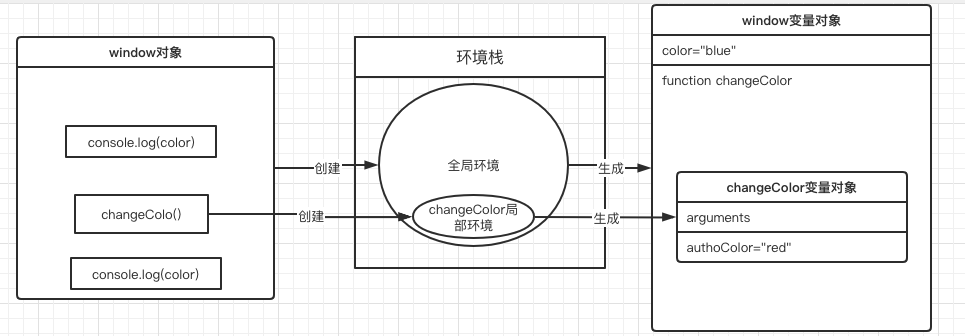
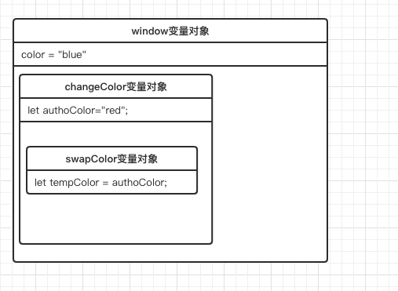

# JS 闭包

## 什么是闭包

闭包是指有权访问一个函数中的变量的函数。简言之**内部函数访问外部函数的变量**，例：函数A包含函数B，B访问了A中的变量。（自我理解：闭包涉及了变量或函数的访问）

## 闭包的产生

在了解闭包之前需要先理解JS执行环境和作用域。

### 执行环境

执行环境简单起见称之为环境，定义了变量或函数的有权访问的其他数据，决定了它们各自的行为。每个环境都包含了一个与之关联的**变量对象**，它保存着环境中所有变量和函数，当环境中所有代码执行完毕后该环境就会被自动销毁，环境中保存的变了对象也随之销毁。

根据执行环境的作用域可分为**全局执行环境**和**局部执行环境**。以Web浏览器为例，全局执行环境被认为是window对象，定义的函数是局部执行环境，只有关闭页面或浏览器时才会被销毁全局执行环境。

* 全局执行环境

全局执行环境是最外围的执行环境。Wbe 浏览器任务window对象是全局执行环境，而Nodejs 认为global是。

* 局部执行环境

当JS执行流进入一个函数时，这个函数会被推进一个环境栈中。此时函数就拥有的执行环境就是局部执行环境作用于当前函数。当函数执行后，环境栈将其弹出销毁局部执行环境把控制权返回调用函数的环境，环境控制权最终是返回给全局执行环境。

示例：

```javascript
// 以Web浏览器为例，先创建window对象的全局环境并生成全局变量对象 1-2代码语句
let color = "blue";// 1-2
function changeColor(){//1-2
  const authoColor="red";
  if(color === isColorRed){
    color="blue"
  }else{
    color="red"
  }
}
// 2-1语句:控制权属于全局环境，输出color值
console.log(color);//2-1
/* 
 * 3-1语句：执行步骤如下
 *		1.先将函数changeColor推进环境栈中创建changeColor局部环境
 *		2.生成与changeColor环境变量对象此时对象中包含了prototype、arguments内
 *			置属性变量和自定义的isColorRed变量
 *		3.执行完changeColor后销毁changeColor环境，
**/
changeColor();//3-1
// 4-1语句：控制权交由window环境控制输出color值
console.log(color);//4-1
```




### 作用域链

当代码在一个环境执行时，会创建变量对象保存着环境中所有变量和函数，也会创建变量或函数可使用访问是作用域、变量或函数的访问链路是作用域链其本质就是指向变量对象的指针列表（只是引用不实际包含）。作用域链的用途是保证了对执行环境有权访问的所有变量和函数的有序访问。简言之函数外不可访问函数内的变量，函数内可以访问函数外变量封顶于全局变量。

示例：

```javascript
let color = "blue";
function changeColor(){
  let authoColor="red";
  function swapColor(){
    let tempColor = authoColor;
    authoColor = color;
    color = tempColor
  }
  swapColor()
}
```



swapColor函数引用了authorColor和color变量

### 总结

执行环境创建了变量对象，而变量对象